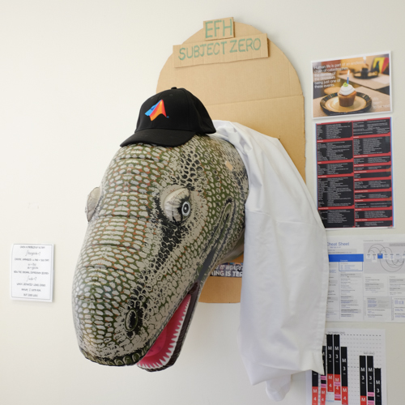

8.5 min read.

I left behind my days working at the bench for working at the computer and white-board. You’d probably ask me why. The short answer is that I found I liked it better. The long answer, as well as some tl;dr takeaways at the bottom of this are below. Here is the story of my first year in grad school training to get a PhD: my path toward understanding machine learning from scratch and what I considered as I was choosing a lab.

My 8 years time in wet-lab environments as a highschooler, undergraduate and technician were productive and I’ve got the cv to prove it. However, there were only a couple times I felt like I was contributing to the experimental design or the logic that was the foundation for what I did every day. Carrying the spectre of imposter syndrome on my back for as long as I’ve wanted to be a scientist, I believed that creatively contributing to the logical foundation of a project was something I had to do to be a “real” scientist. Hungry for that, I went into my first-year neuroscience PhD rotations. 

### Rotation 1: Kind of a nightmare

First I started in the familiar setting of a cellular and molecular (CM) based neuroscience lab. I was excited to use my skills to jump into a project and potentially contribute the way I wanted to. However, I quickly learned the lesson that one’s experience in the lab can highly depend on the people you are working with. The post-doc that was tasked to teach me the basics of the where and what of the lab refused to even acknowledge me. Communication between me, them, and my advisor on what my project would be was muddled, confusing and tedious. In the final weeks of the rotation, I was wishing my cells would get contaminated so I wouldn’t have to come into lab anymore. The final nail in the coffin was when I finally did what I should have done in the first place: I asked the graduate students what they thought of the lab environment. Much to my suspicions, they emphatically told me to look elsewhere for guidance and mentorship - they saw how unhappy I was there and from their experience they knew it would only get worse. It was a nightmare.

### Rotation 2: Becoming grounded in a Computational Lab

Shaken, I realized I didn’t know what to look for in a rotation, and that the science topic was not the only thing to consider. Leaning into my longtime, yet unexplored interest in computational neuroscience, I started my next rotation in a computational and theoretical lab and I felt like I was in over my head. In this lab, the postdoc assigned to me was, in comparison to the last one, like an angel from heaven. They explained to me the material, answered my questions, and even vulnerably pulled back the curtain to show that they were a human too with insecurities about their science and whether they belonged. This grounded me and showed me that I was not alone and that even scientists who have earned PhD after their name have had the same insecurities I had. 

With this kind of guidance and support, I faced the daunting and scary task of learning Python from scratch. I quickly discovered that google was my friend. In the most disorganized push for knowledge acquisition, I googled everything almost haphazardly with only the example code I was “decoding” as my anchor. As someone who had learned almost exclusively from formal books and lectures this was a  nerve-wracking experience. But I quickly accepted this disorganization and had faith that as I learned more building blocks, things would make more sense.  And they did! By the end of the rotation I had a grapple on how to use matrices with for-loops so that I could apply my newly learned concepts in information theory to analysis of actual monkey behavior data. Looking back, it was a small, baby project compared to what I can do now -- but know that my pride was not small. It was a major accomplishment for me! And I’ve built on that momentum ever since.

### Rotation 3: One more chance and the hardest class I’ve ever taken in my life

The next semester I rotated in new CM neuroscience lab to give it another go. I found the material to be incredibly interesting. When I talked to several students there I realized the development path of a scientist in this lab was to learn two different techniques, master them, and then use them on whatever questions or new material you could get your hands on. This seemed unsavory to me. I wanted to have the freedom to ask questions that may go beyond whatever limited two skills I happened to invest in. Perhaps I did not have the wisdom to see that with two skills I could ask many questions. But to me at the time, it didn’t make sense to limit myself like that. I wanted my inquiry to be based on what I wanted to know, not based strictly on what I could do. 

During this rotation I had to choose relevant classes. After my first comp neuro rotation I felt like I needed more of a bridge to this possibly new field I could jump to. I had a lot of trouble learning coding, but I knew I could do it even if very slowly. So I decided to take a theoretical and computational neuroscience class as a formal introduction that could help me improve my skills enough so that I could potentially come back to the comp neuro lab with the skills needed to really get going.

This was the hardest class I had ever taken. It was a crash course in Matlab, a language I did not know, concurrent with a formal course on neuroscience theory, something I had never considered existed before grad school. I was incredibly nervous taking the class, but by then  had friends and classmates in the course, so I felt like I had the support structure to take on this challenge. Therefore, with courage, I committed to the class. I worked harder than I ever did for any other class. Each homework was a coding tutorial that walked you through the logic of a problem without telling you how exactly to implement each step - you had to figure out the implementation on your own. I dedicated huge amounts of time to this class. I asked for help often. I got frustrated many times. But I realized the class had been taught for 9 years before I took it, and that the homework had solutions - I just had to find them. So each time I got frustrated I would take a break, tell myself that it was okay that I wasn’t getting it immediately, and come back to the work with a clear head. The whole semester was like this, but I kept at it, having faith that by the end of the course I would have achieved a new level of coding competence.

The class culminated in a final group project. My friends and I came together and chose the topic to be dendritic modeling and investigating the effects of inhibition on simultaneous excitatory input on dendritic branches. It was a cool project and I was scared, yet excited to work on a project with no guaranteed solution. Everyone in my group besides me hit the ground running with some working code that we could start to play with. I struggled to understand what exactly the code was doing, so I dedicated my energies to playing catchup and reading literature. I kept with it at my own pace - I learned more about dendritic nonlinearities. I re-reviewed my notes on multi-compartment modeling. I read from Izhikevich’s Dynamical Systems in Neuroscience book. And I offered to write the literature review for the group writeup. Even though I wasn’t at the forefront of coding for the project, I at least knew the literature contextualizing our project. I was going to own the project in some way. In the end, we successfully presented our work. I left the course with an A.

### Rotation 4: Machine learning in the Kording Lab

Caption: Subject Zero, Kording Lab Mascot

After that class and rotation, I had decided I was done with CM work. I found that I had been merely tolerating wet-lab work when I was, by this point, enjoying the clarity of logic and thought required for coding and theoretical work. By then I had realized I needed more than an interesting topic in a lab. I needed a supportive lab environment. I needed tasks that required more from me than careful dexterity. I needed to enjoy my day-to-day experience in the lab.

So I rotated in the Kording lab. I brought with me my experience and knowledge from the dendritic modeling project to Konrad Kording and we came up with a project I could develop and call my own. Excited to start, I realized suddenly that I was in the deep end of the lab’s expertise: machine learning. This was material I had no experience in. I was going to shelve Matlab and pick up Python again to learn PyTorch. Conversations I overheard between labmates were indecipherable. Model selection. Monte Carlo. Reinforcement learning. I didn’t understand anything at all, but I took note of what I didn’t know and turned to the answer machine: the internet. I worked through an MNIST classifier tutorial and tried to learn the ins and outs of every piece. I used stack overflow for help extensively. However, it took me too long to learn I could ask for help in the lab. I thought that every question I had was about something basic, and I couldn’t bother my labmates with something basic if I could just look it up myself. But eventually, after running into various brick walls and spending hours getting nowhere on answering various questions, I realized I needed help. Now I know that contained in my lab is a wealth of knowledge held by kind, eager to help labmates. I regret not asking for help sooner.

The day to day was amazing. Konrad came around to ask how I was doing every day. I was excited to come into the lab to try new solutions I dreamt up the night before. I eventually became fluent in PyTorch and could read Python code. I found I could explain my project in a few sentences when before it would take me a confusing few minutes. I saw that I was developing my skills rapidly. I was beginning to break tasks down into smaller, achievable pieces. I was starting to think computationally. Even though I was working on something that had no guarantee of working, I still made little victories. I was happy where I was. So I joined the Kording lab and **[here I am.](http://kordinglab.com/people/ilenna_jones/index.html)**

Kording Lab during the 2019 Lab Retreat

## Takeaways

### A new beginning: Starting to code

**Have a beginner’s mindset**: Frustration stops you from thinking. Forgiving yourself for only learning as fast as you can is crucial when learning a new skill. If you’re a beginner, you’ll be bad at what you do until you learn how to get better. That’s the chronology.

**Courage and Perseverance**: It takes a lot of guts to try something new. There is no final answer when it comes to research, and you will fail many times. Face down opportunities to fail or succeed at something, and when you do inevitably fail at something pick yourself back up and try again in a different way.

**Ask for help**: Whether it’s Google, a classmate, or a more experienced labmate, asking for help is just part of the process. Asking for help does not reflect poorly on you, it only reflects your resilience in the face of a problem.

**Break things down and relish the little victories**: Many times I found that the things I could say most simply were the most complicated. Breaking tasks down into its smallest pieces and implementing those pieces gave me many chances to congratulate myself for making progress. This kept me going, even when it seemed like I was making glacial progress toward the larger goal.

### Finding where you belong: Choosing a lab that matches you

**Ask the grad students what it’s like**: Students in the lab will know better than anyone else what the advisor’s style is, what the culture of the lab is, and whether or not they enjoy their time there.

**Think about what you want out of the lab experience**: Be it having mastery of a cutting edge technique or learning a particular kind of approach to science, knowing what you want out of your training will help determine what lab will match you.

**Find a supportive lab environment**: Your lab will be full of people in various stages of training.You learning from them will benefit you and them teaching you will benefit them. You’ll be spending many years there, so try to see if you get along with the people. Lab culture shouldn’t just be tolerated, it should be nurtured and nurturing.

Hopefully my story and takeaways will be useful to you, whether you yourself are facing the decision of going more computational, you are picking up a few new coding skills, or you’re advising a student considering computation in their future. Good luck!